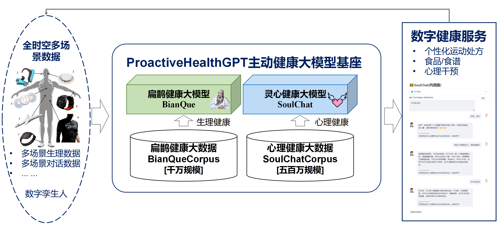
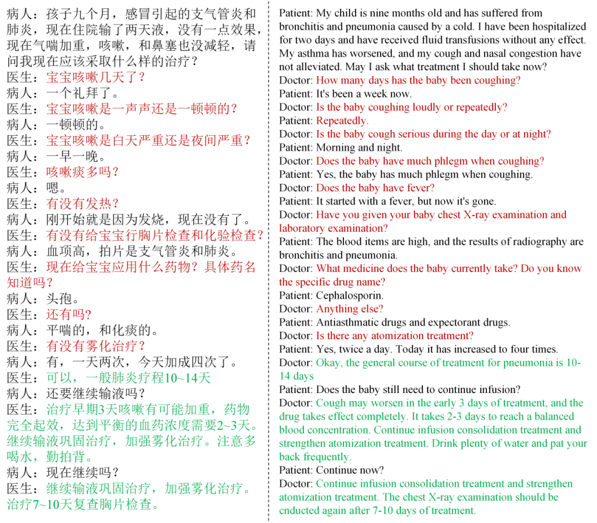
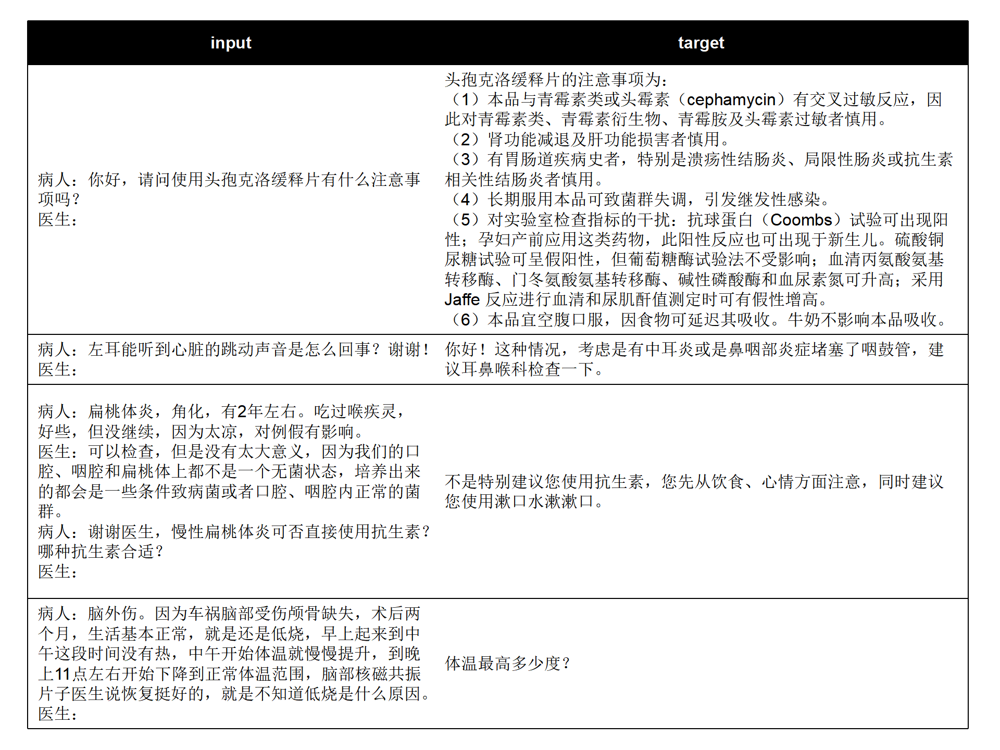
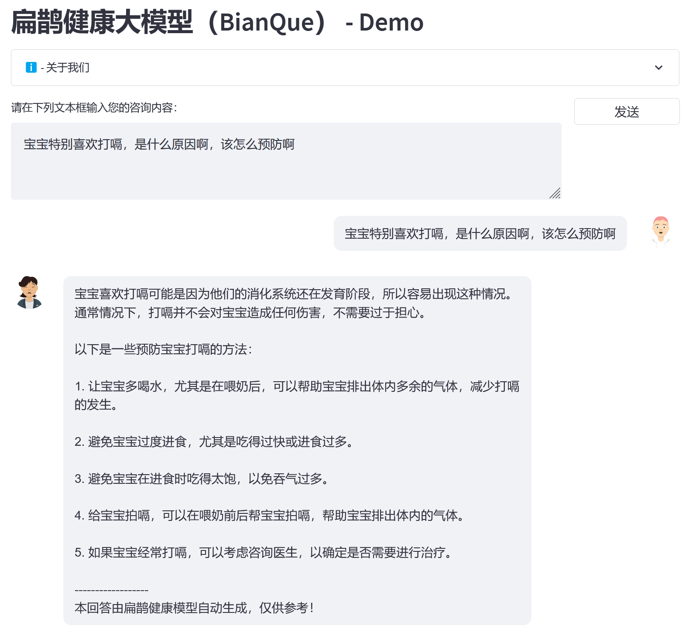
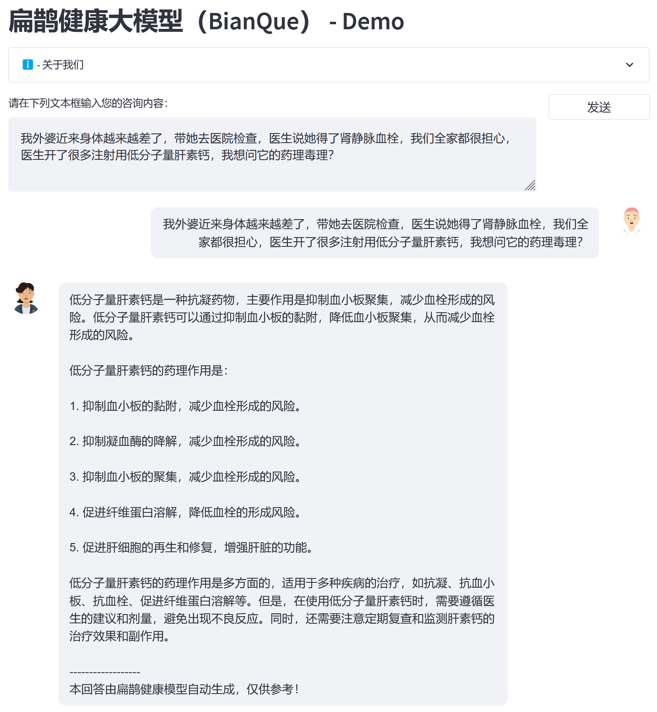
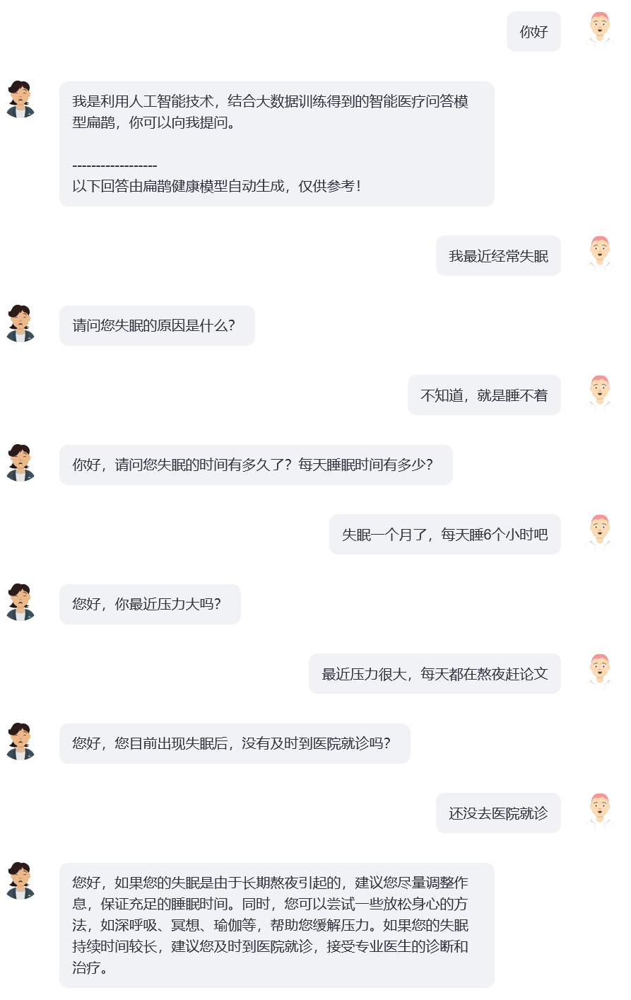

# [扁鹊（BianQue）]((https://github.com/scutcyr/BianQue))
<p align="center">
    
</p>
<p align="center">
    <a href="./LICENSE"></a>
    <a href="support os"></a>
    <a href=""></a>
    <a href="https://github.com/scutcyr/BianQue/graphs/contributors"></a>
    <a href="https://github.com/scutcyr/BianQue/commits"></a>
    <a href="https://github.com/scutcyr/BianQue/issues"></a>
    <a href="https://github.com/scutcyr/BianQue/stargazers"></a>
</p>

基于主动健康的主动性、预防性、精确性、个性化、共建共享、自律性六大特征，华工未来技术学院-广东省数字孪生人重点实验室开源了中文领域生活空间主动健康大模型基座ProactiveHealthGPT，包括：
* 经过千万规模中文健康对话数据指令微调的[生活空间健康大模型扁鹊（BianQue）](https://github.com/scutcyr/BianQue)    
* 经过百万规模心理咨询领域中文长文本指令与多轮共情对话数据联合指令微调的[心理健康大模型灵心（SoulChat）](https://github.com/scutcyr/SoulChat)   

我们期望，**生活空间主动健康大模型基座ProactiveHealthGPT** 可以帮助学术界加速大模型在慢性病、心理咨询等主动健康领域的研究与应用。本项目为 **生活空间健康大模型扁鹊（BianQue）** 。

## 最近更新
- 👏🏻  2023.06.06: 扁鹊-2.0模型开源，详情见[BianQue-2.0](https://huggingface.co/scutcyr/BianQue-2.0)。
- 👏🏻  2023.06.06: 具备共情与倾听能力的灵心健康大模型SoulChat发布，详情见：[灵心健康大模型SoulChat：通过长文本咨询指令与多轮共情对话数据集的混合微调，提升大模型的“共情”能力 ](https://huggingface.co/scutcyr/SoulChat)。
- 👏🏻  2023.04.22: 基于扁鹊-1.0模型的医疗问答系统Demo，详情访问：[https://huggingface.co/spaces/scutcyr/BianQue](https://huggingface.co/spaces/scutcyr/BianQue)
- 👏🏻  2023.04.22: 扁鹊-1.0版本模型发布，详情见：[扁鹊-1.0：通过混合指令和多轮医生问询数据集的微调，提高医疗聊天模型的“问”能力（BianQue-1.0: Improving the "Question" Ability of Medical Chat Model through finetuning with Hybrid Instructions and Multi-turn Doctor QA Datasets）](https://huggingface.co/scutcyr/BianQue-1.0)


### 扁鹊健康大数据BianQueCorpus
我们经过调研发现，在健康领域，用户通常不会在一轮交互当中清晰地描述自己的问题，而当前常见的开源医疗问答模型（例如：ChatDoctor、本草(HuaTuo，原名华驼 )、DoctorGLM、MedicalGPT-zh）侧重于解决单轮用户描述的问题，而忽略了“用户描述可能存在不足”的情况。哪怕是当前大火的ChatGPT也会存在类似的问题：如果用户不强制通过文本描述让ChatGPT采用一问一答的形式，ChatGPT也偏向于针对用户的描述，迅速给出它认为合适的建议和方案。然而，实际的医生与用户交谈往往会存在“医生根据用户当前的描述进行持续多轮的询问”。并且医生在最后根据用户提供的信息综合给出建议，如下图所示。我们把医生不断问询的过程定义为 **询问链（CoQ, Chain of Questioning）** ，当模型处于询问链阶段，其下一个问题通常由对话上下文历史决定。

<p align="center">
    
</p>


我们结合当前开源的中文医疗问答数据集（[MedDialog-CN](https://github.com/UCSD-AI4H/Medical-Dialogue-System)、[IMCS-V2](https://github.com/lemuria-wchen/imcs21)、[CHIP-MDCFNPC](https://tianchi.aliyun.com/dataset/95414)、[MedDG](https://tianchi.aliyun.com/dataset/95414)、[cMedQA2](https://github.com/zhangsheng93/cMedQA2)、[Chinese-medical-dialogue-data](https://github.com/Toyhom/Chinese-medical-dialogue-data)），，分析其中的单轮/多轮特性以及医生问询特性，结合实验室长期自建的生活空间健康对话大数据，构建了千万级别规模的扁鹊健康大数据BianQueCorpus。对话数据通过“病人：xxx\n医生：xxx\n病人：xxx\n医生：”的形式统一为一种指令格式，如下图所示。

<p align="center">
    
</p>


```data
input: "病人：六岁宝宝拉大便都是一个礼拜或者10天才一次正常吗，要去医院检查什么项目\n医生：您好\n病人：六岁宝宝拉大便都是一个礼拜或者10天才一次正常吗，要去医院检查什么项目\n医生：宝宝之前大便什么样呢？多久一次呢\n病人：一般都是一个礼拜，最近这几个月都是10多天\n医生：大便干吗？\n病人：每次10多天拉的很多\n医生："
target: "成形还是不成形呢？孩子吃饭怎么样呢？"
```

训练数据当中混合了大量target文本为**医生问询的内容**而非直接的建议，这将有助于提升AI模型的问询能力。


## 使用方法
* 克隆本项目
```bash
cd ~
git clone https://github.com/scutcyr/BianQue.git
```

* 安装依赖
需要注意的是torch的版本需要根据你的服务器实际的cuda版本选择，详情参考[pytorch安装指南](https://pytorch.org/get-started/previous-versions/)
```bash
cd BianQue
conda env create -n proactivehealthgpt_py38 --file proactivehealthgpt_py38.yml
conda activate proactivehealthgpt_py38

pip install cpm_kernels
pip install torch==1.13.1+cu116 torchvision==0.14.1+cu116 torchaudio==0.13.1 --extra-index-url https://download.pytorch.org/whl/cu116
```

* 在Python当中调用BianQue-2.0模型：
```python
import torch
from transformers import AutoModel, AutoTokenizer
# GPU设置
device = torch.device("cuda" if torch.cuda.is_available() else "cpu")
# 加载模型与tokenizer
model_name_or_path = 'scutcyr/BianQue-2.0'
model = AutoModel.from_pretrained(model_name_or_path, trust_remote_code=True).half()
model.to(device)
tokenizer = AutoTokenizer.from_pretrained(model_name_or_path, trust_remote_code=True)

# 单轮对话调用模型的chat函数
user_input = "我的宝宝发烧了，怎么办？"
input_text = "病人：" + user_input + "\n医生："
response, history = model.chat(tokenizer, query=input_text, history=None, max_length=2048, num_beams=1, do_sample=True, top_p=0.75, temperature=0.95, logits_processor=None)

# 多轮对话调用模型的chat函数
# 注意：本项目使用"\n病人："和"\n医生："划分不同轮次的对话历史
# 注意：user_history比bot_history的长度多1
user_history = ['你好', '我最近失眠了']
bot_history = ['我是利用人工智能技术，结合大数据训练得到的智能医疗问答模型扁鹊，你可以向我提问。']
# 拼接对话历史
context = "\n".join([f"病人：{user_history[i]}\n医生：{bot_history[i]}" for i in range(len(bot_history))])
input_text = context + "\n病人：" + user_history[-1] + "\n医生："

response, history = model.chat(tokenizer, query=input_text, history=None, max_length=2048, num_beams=1, do_sample=True, top_p=0.75, temperature=0.95, logits_processor=None)
```


## 扁鹊-2.0
基于扁鹊健康大数据BianQueCorpus，我们选择了 [ChatGLM-6B](https://huggingface.co/THUDM/chatglm-6b) 作为初始化模型，经过全量参数的指令微调训练得到了[新一代BianQue【BianQue-2.0】](https://huggingface.co/scutcyr/BianQue-2.0)。与扁鹊-1.0模型不同的是，扁鹊-2.0扩充了药品说明书指令、医学百科知识指令以及ChatGPT蒸馏指令等数据，强化了模型的建议与知识查询能力。以下为两个测试样例。


* 样例1：宝宝特别喜欢打嗝，是什么原因啊，该怎么预防啊
<p align="center">
    
</p>

* 样例2：我外婆近来身体越来越差了，带她去医院检查，医生说她得了肾静脉血栓，我们全家都很担心，医生开了很多注射用低分子量肝素钙，我想问它的药理毒理？
<p align="center">
    
</p>


## 扁鹊-2.0与扁鹊-1.0联合使用，兼顾多轮问询与出色的健康建议能力
通过以下命令实现联合使用扁鹊-2.0与扁鹊-1.0构建主动健康服务：
```bash
streamlit run bianque_v1_v2_app.py --server.port 9005
```

以下为应用例子：前面若干轮为经过扁鹊-1.0模型进行问询的过程，最后一轮回复为经过扁鹊-2.0模型的回答。
<p align="center">
    
</p>


## 扁鹊-1.0

**扁鹊-1.0（BianQue-1.0）** 是一个经过指令与多轮问询对话联合微调的医疗对话大模型。我们经过调研发现，在医疗领域，往往医生需要通过多轮问询才能进行决策，这并不是单纯的“指令-回复”模式。用户在咨询医生时，往往不会在最初就把完整的情况告知医生，因此医生需要不断进行询问，最后才能进行诊断并给出合理的建议。基于此，我们构建了 **扁鹊-1.0（BianQue-1.0）** ，拟在 **强化AI系统的问询能力** ，从而达到模拟医生问诊的过程。我们把这种能力定义为“望闻问切”当中的“问”。综合考虑当前中文语言模型架构、参数量以及所需要的算力，我们采用了[ClueAI/ChatYuan-large-v2](https://huggingface.co/ClueAI/ChatYuan-large-v2)作为基准模型，在8张 NVIDIA RTX 4090显卡上微调了1个epoch得到**扁鹊-1.0（BianQue-1.0）**，用于训练的**中文医疗问答指令与多轮问询对话混合数据集**包含了超过900万条样本，这花费了大约16天的时间完成一个epoch的训练。我们将计划围绕扁鹊模型的“望闻问切”能力，结合医学专家知识、多模态技术、多生理信号计算等，进行多个版本的模型迭代研究。扁鹊（BianQue）模型欢迎你的贡献！我们鼓励你在 [BianQue GitHub](https://github.com/scutcyr/BianQue) 页面报告问题、贡献 PR 并参与讨论。我们期待与更多的高校、医院、研究实验室、公司等进行合作，共同开展下一代扁鹊模型研究。对于此类需求（以及其他不适合在 GitHub 上提出的需求），请直接发送电子邮件至 [eeyirongchen@mail.scut.edu.cn](mailto:eeyirongchen@mail.scut.edu.cn)。


### 模型“问”能力示例
“望闻问切”四诊法由扁鹊发明。“四诊法”（望、闻、问、切），是中医诊病的基本方法。其中，“问”的能力可以被建模到语言模型当中。我们把AI模型的“问”能力定义为：    
**“问”能力**：AI模型能够根据病人输入的信息，结合医学知识来进行**恰当的问询**，并且结合进一步的问询得到的病人的信息，给出“合适的诊断或建议”。“问”的过程通常是一个多轮对话过程。

以下是2个简单的例子：

* **例子1**    
用户：我最近感觉全身疲惫   
扁鹊-1.0：是劳累了，还是熬夜了？    
用户：这周都在熬夜赶论文    
扁鹊-1.0：嗯，熬夜容易引起各种不适，如头晕、乏力、失眠、多梦等，多休息，可以口服谷维素、维生素B1和安神补脑液，避免熬夜。    

* **例子2**   
用户：我最近经常失眠    
扁鹊-1.0：失眠多久了？    
用户：两周了    
扁鹊-1.0：睡眠怎么样？    
用户：上床几小时才睡得着    
扁鹊-1.0：可以口服一些药物   
用户：有具体推荐吗   
扁鹊-1.0：需要先检查一下   
用户：那我需要做什么检查？   
扁鹊-1.0：心电图   


### 使用方法

#### 直接使用扁鹊-1.0模型

```python
import os
from transformers import T5Tokenizer, T5ForConditionalGeneration, AutoTokenizer
import torch
device = torch.device("cuda" if torch.cuda.is_available() else "cpu")


tokenizer = T5Tokenizer.from_pretrained("scutcyr/BianQue-1.0")
model = T5ForConditionalGeneration.from_pretrained("scutcyr/BianQue-1.0")


def preprocess(text):
    text = text.replace("\n", "\\n").replace("\t", "\\t")
    return text

def postprocess(text):
    return text.replace("\\n", "\n").replace("\\t", "\t")

def answer(user_history, bot_history, sample=True, top_p=1, temperature=0.7):
    '''sample：是否抽样。生成任务，可以设置为True;
    top_p：0-1之间，生成的内容越多样
    max_new_tokens=512 lost...'''

    if len(bot_history)>0:
        context = "\n".join([f"病人：{user_history[i]}\n医生：{bot_history[i]}" for i in range(len(bot_history))])
        input_text = context + "\n病人：" + user_history[-1] + "\n医生："
    else:
        input_text = "病人：" + user_history[-1] + "\n医生："
        return "我是利用人工智能技术，结合大数据训练得到的智能医疗问答模型扁鹊，你可以向我提问。"
    

    input_text = preprocess(input_text)
    print(input_text)
    encoding = tokenizer(text=input_text, truncation=True, padding=True, max_length=768, return_tensors="pt").to(device) 
    if not sample:
        out = model.generate(**encoding, return_dict_in_generate=True, output_scores=False, max_new_tokens=512, num_beams=1, length_penalty=0.6)
    else:
        out = model.generate(**encoding, return_dict_in_generate=True, output_scores=False, max_new_tokens=512, do_sample=True, top_p=top_p, temperature=temperature, no_repeat_ngram_size=3)
    out_text = tokenizer.batch_decode(out["sequences"], skip_special_tokens=True)
    print('医生: '+postprocess(out_text[0]))
    return postprocess(out_text[0])

answer_text = answer(user_history=["你好！",
                                   "我最近经常失眠",
                                   "两周了",
                                   "上床几小时才睡得着"], 
                     bot_history=["我是利用人工智能技术，结合大数据训练得到的智能医疗问答模型扁鹊，你可以向我提问。",
                                  "失眠多久了？",
                                  "睡眠怎么样？"])
```

#### 使用个人数据在扁鹊-1.0模型基础上进一步微调模型
* 环境创建   
以下为在RTX 4090显卡，CUDA-11.6驱动配置下的环境配置
```bash
conda env create -n bianque_py38 --file py38_conda_env.yml
conda activate bianque_py38
pip install torch==1.13.1+cu116 torchvision==0.14.1+cu116 torchaudio==0.13.1 --extra-index-url https://download.pytorch.org/whl/cu116
```
* 数据集构建   
参考[.data/cMedialog_example.csv](.data/cMedialog_example.csv)格式，构建你的数据集
* 基于扁鹊-1.0模型微调你的模型    
修改[./scripts/run_train_model_bianque.sh](./scripts/run_train_model_bianque.sh)，通过绝对路径指定PREPROCESS_DATA，并且调整其他变量，然后运行：
```bash
cd scripts
bash run_train_model_bianque.sh
```


## 声明

**扁鹊-1.0（BianQue-1.0）** 当前仅经过1个epoch的训练，尽管模型具备了一定的医疗问询能力，但其仍然存在以下局限：
* 训练数据来源于开源数据集以及互联网，尽管我们采用了严格的数据清洗流程，数据集当中仍然不可避免地存在大量噪声，这会使得部分回复产生错误；
* 医生“问询”是一项复杂的能力，这是非医生群体所不具备的，当前的模型对于模拟“医生问询”过程是通过大量样本学习得到的，因此在问询过程当中，有可能出现一些奇异的提问风格。换一句话来说，当前版本的模型强化了“问”的能力，但是“望”、“闻”、“切”的能力仍待进一步研究！


## 引用
```bib
@article{chen2023bianque1,
      title={BianQue-1.0: Improving the "Question" Ability of Medical Chat Model through finetuning with Hybrid Instructions and Multi-turn Doctor QA Datasets}, 
      author={Yirong Chen and Zhenyu Wang and Xiaofen Xing and Zhipei Xu and Kai Fang and Sihang Li and Junhong Wang and Xiangmin Xu},
      year={2023},
      url={https://github.com/scutcyr/BianQue}
}
```
